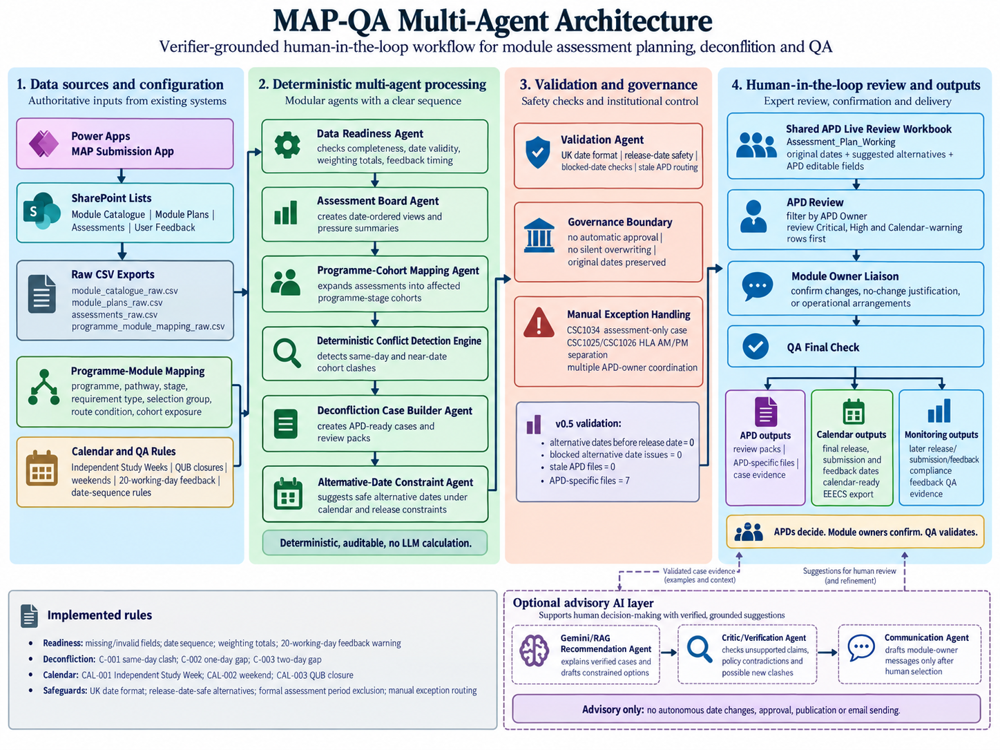

  

  <em>
    Figure 1. MAP-QA multi-agent architecture. Structured Power Apps and SharePoint MAP records are processed through deterministic readiness, cohort-mapping, conflict-detection, deconfliction and validation agents before APD-led human review. The optional Gemini/RAG layer is advisory only and supports explanation, critique and communication drafting without autonomous calculation, approval, publication or email sending.
  </em>

A Verifier-Grounded Agentic AI System for Policy-Constrained Planning
Agentic MAP-QA

A Verifier-Grounded Multi-Agent AI System for Policy-Constrained Assessment Planning

This repository contains the working implementation of the MAP Agentic QA system developed for the School of Electronics, Electrical Engineering and Computer Science (EEECS), Queen’s University Belfast.

The system supports the 2026/27 Module Assessment Planning (MAP) process through a multi-agent workflow that combines deterministic data validation, programme-cohort mapping, assessment deconfliction, calendar-rule checking, validation and APD-ready review outputs.

The system is designed as a human-in-the-loop, verifier-grounded multi-agent QA workflow. It does not approve, publish or change assessment dates automatically. Instead, each agent performs a clearly bounded QA task, produces traceable evidence, and supports APDs and module owners in making the final academic decisions.

Purpose

The MAP Agentic QA system helps identify and manage assessment-planning issues before assessment dates are released to students. It focuses on:

data-readiness checks across MAP submissions;

assessment date consistency and feedback timing checks;

programme-stage cohort exposure mapping;

same-day and near-date assessment pressure detection;

EEECS calendar-rule checks;

APD-specific deconfliction review packs;

validation of suggested alternative dates;

preparation for final EEECS Assessment Calendar release;

a staged multi-agent workflow with clear hand-off points between agents.

Multi-agent system architecture

The project is organised as a multi-agent system, where each agent has a bounded responsibility and passes verified outputs to the next stage of the workflow. The agents are not autonomous decision-makers; they are deterministic QA components that support transparent, auditable, human-approved assessment planning.

Agent / component

Role in the multi-agent workflow

Output produced

Data Readiness Agent

Validates raw MAP exports, checks required fields, normalises dates, and identifies readiness issues.

Clean assessment data and readiness issue reports.

Assessment Board Agent

Creates assessment-board style views, including all assessments by date, same-day pressure, near-date pressure and feedback warnings.

Assessment board CSV outputs.

Programme-Cohort Mapping Agent

Expands module assessment rows into affected programme-stage cohort exposure using the programme-module mapping.

Affected cohort assessment rows and cohort-level pressure files.

Deconfliction Case Builder Agent

Builds APD-ready cases from cohort pressure outputs and calendar-rule checks.

Main deconfliction cases, calendar warnings, feedback warnings and APD-specific packs.

Validation Agent

Verifies APD-facing outputs before release, including UK date format, blocked-date avoidance, release-date safety and stale APD routing files.

Validation report for QA sign-off.

Human APD / Module Owner Review

Provides final academic judgement, confirms changes or justifications, and records agreed outcomes.

Shared live deconfliction workbook and final QA-ready decisions.

This design keeps the system agentic in workflow structure but controlled in authority: software agents detect, structure and validate issues; humans make and approve academic decisions.

Core design principle

The project follows a verifier-grounded multi-agent approach:

Deterministic checks first
Dates, rules, mappings and validation checks are handled using transparent rule-based code.

Evidence before recommendation
Every deconfliction case is generated from traceable input rows and includes a case ID, affected cohort, severity, rule trigger and evidence summary.

Human approval required
APDs and module owners remain responsible for final academic decisions. The system does not automatically alter submitted MAP records.

Operational data is not committed
Raw SharePoint exports, generated CSV outputs and shared Excel workbooks are excluded from GitHub.

Workflow overview

Raw MAP exports
    ↓
Agent 1: Data Readiness Agent
    ↓
Clean assessment data + readiness issues
    ↓
Agent 2: Assessment Board Agent
    ↓
Assessment board pressure views
    ↓
Agent 3: Programme-Cohort Mapping Agent
    ↓
Affected cohort assessment rows
    ↓
Agent 4: Deconfliction Case Builder Agent
    ↓
APD review packs + calendar warnings + feedback warnings
    ↓
Agent 5: Validation Agent
    ↓
Shared APD working workbook
    ↓
Human APD/module-owner review
    ↓
Final QA check
    ↓
EEECS Assessment Calendar preparation

Main agents and scripts

The codebase implements the multi-agent workflow as separate scripts/components so that each stage can be run, inspected and validated independently.

Script

Purpose

src/agents/data_readiness_agent/data_readiness_agent.py

Checks raw MAP exports for missing values, invalid dates, feedback timing issues and readiness problems.

src/agents/data_readiness_agent/create_assessment_board.py

Creates assessment-board style outputs sorted by submission date, same-day pressure, near-date pressure and feedback warnings.

src/agents/programme_cohort_mapping_agent.py

Expands assessment rows into programme-stage cohort exposure using the programme-module mapping file.

src/agents/create_deconfliction_cases.py

Builds APD-ready deconfliction cases, calendar-rule warnings, feedback warnings and APD-specific review packs.

src/agents/validate_deconfliction_outputs.py

Validates APD-facing outputs, including UK date format, blocked-date avoidance, release-date safety and stale APD files.

src/agents/inspect_deconfliction_cases.py

Provides summary inspection of deconfliction outputs for QA review.

Key outputs

Generated outputs are written under:

outputs/2026_27_readiness_03Sep/

Key output groups include:

programme_cohort_mapping/
deconfliction_cases/
deconfliction_cases/apd_review_packs/

Important generated files include:

Output file

Purpose

MAP_Deconfliction_Cases_Draft.csv

Main date deconfliction cases.

MAP_Calendar_Rule_Warnings.csv

Independent Study Week, weekend and QUB closure warnings.

MAP_Feedback_Timing_Warnings.csv

Feedback timing warnings.

MAP_Unmapped_Calendar_Modules.csv

Calendar-included modules not currently mapped to normal programme-stage cohorts.

MAP_Assessment_Only_Manual_Cases.csv

Assessment-only/manual review cases, including CSC1034.

MAP_APD_Review_Pack.csv

Combined APD review file.

apd_review_packs/*.csv

APD-specific review packs.

These files are generated operational outputs and should not normally be committed to GitHub.

2026/27 APD deconfliction workflow

For the 2026/27 MAP cycle, APDs review the generated outputs through a shared workbook in the Education folder:

MAP_Assessment_Deconfliction_Working_2026_27_FIXED_UK_DATES.xlsx

The APD-facing process is:

Open the shared workbook.

Use the Assessment_Plan_Working sheet.

Filter or search by APD owner.

Prioritise Critical, High and Calendar rule warning rows.

Liaise with module owners where required.

Record agreed outcomes in the APD editable columns only.

Do not overwrite original predicted MAP dates.

Final QA review is completed before calendar release.

Severity model

Severity

Meaning

Expected action

Critical

Definite or serious issue, such as same-day high-pressure clashes or QUB closure dates.

Immediate APD/module-owner review.

High

Likely workload or calendar issue requiring APD sense-check.

APD review and possible date adjustment.

Warning

Lower-risk issue, feedback timing warning, weekend date, or advisory case.

Review if relevant; may be acceptable with justification.

Exception

Special case outside normal cohort deconfliction.

Manual QA/APD review.

Calendar rules

The system checks assessment dates against known EEECS calendar constraints for 2026/27:

Independent Study Weeks should normally avoid assessment submissions and class tests.

QUB closure periods should not contain assessment submission dates.

Weekends are flagged for review.

Suggested alternative coursework/class-test dates avoid the formal assessment period.

Suggested alternative dates also avoid dates before the relevant assessment release date.

Current validation status

The v0.5 APD deconfliction workflow has been validated with the following checks:

Alternative dates before release date: 0
Blocked alternative date issues: 0
Stale Joseph APD files: 0
APD-specific files created: 7

The APD routing for Data Science is assigned to Dr Neil Anderson for this MAP review.

CSC1034 is treated as an assessment-only/manual review case and is not included in normal Level 1 cohort deconfliction.

Running the workflow

Run scripts from the repository root.

python src/agents/data_readiness_agent/data_readiness_agent.py
python src/agents/data_readiness_agent/create_assessment_board.py
python src/agents/programme_cohort_mapping_agent.py
python src/agents/create_deconfliction_cases.py
python src/agents/validate_deconfliction_outputs.py

Alternatively, each script can be opened and run directly in VS Code.

Repository structure

agentic-map-qa/
├── configs/
│   ├── column_mapping.yaml
│   ├── paths.yaml
│   └── readiness_rules.yaml
├── data/
│   └── raw/                  # ignored by Git
├── docs/
│   └── MAP_Implementation_Log.md
├── outputs/                  # ignored by Git
├── src/
│   └── agents/
│       ├── create_deconfliction_cases.py
│       ├── inspect_deconfliction_cases.py
│       ├── programme_cohort_mapping_agent.py
│       ├── validate_deconfliction_outputs.py
│       └── data_readiness_agent/
│           ├── create_assessment_board.py
│           └── data_readiness_agent.py
└── README.md

Data governance

The following should not be committed to GitHub:

raw SharePoint / MAP exports;

generated output CSV files;

APD-specific review CSVs;

shared Excel working files;

files containing live operational decisions or staff comments.

Only source code, configuration files and documentation should be committed.

Status

This repository currently supports the 2026/27 EEECS MAP QA and assessment deconfliction workflow using a staged, verifier-grounded multi-agent architecture. The system is under active development and is intended to support transparent, auditable, policy-constrained assessment planning.