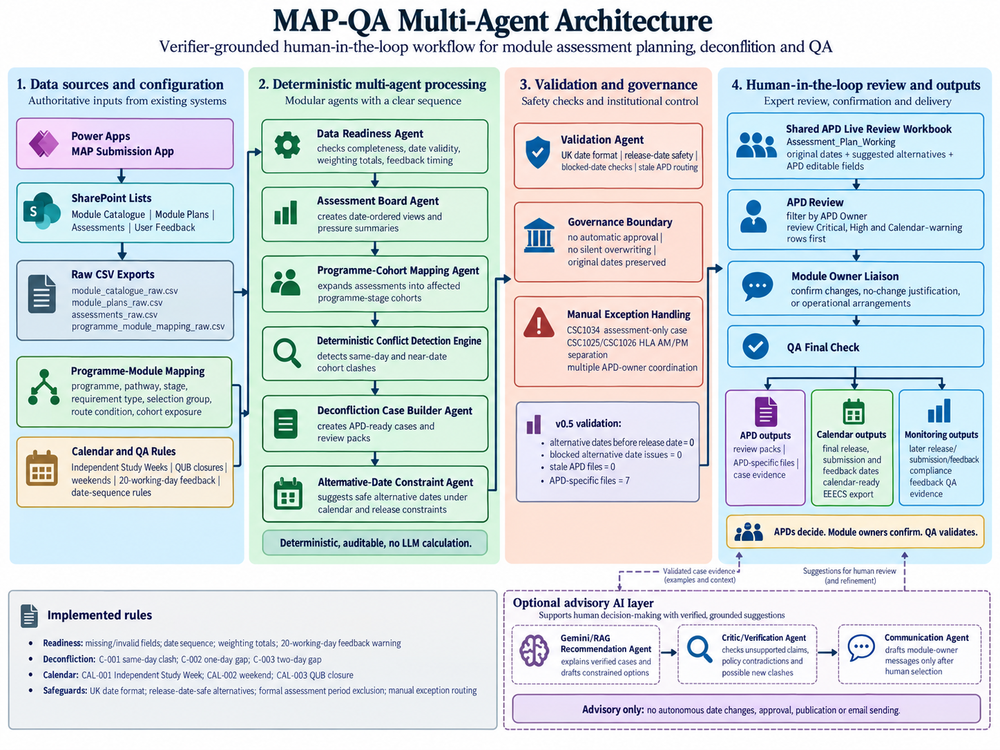

<p align="center">
  
</p>

<p align="center">
  <em>
    Figure 1. MAP-QA multi-agent architecture. Structured Power Apps and SharePoint MAP records are processed through deterministic readiness, cohort-mapping, conflict-detection, deconfliction and validation agents before APD-led human review. The optional Gemini/RAG layer is advisory only and supports explanation, critique and communication drafting without autonomous calculation, approval, publication or email sending.
  </em>
</p>

# Agentic MAP-QA

## A Verifier-Grounded Multi-Agent AI System for Policy-Constrained Assessment Planning

This repository contains the working implementation of the MAP Agentic QA system developed for the School of Electronics, Electrical Engineering and Computer Science (EEECS), Queen’s University Belfast.

The system supports the 2026/27 Module Assessment Planning (MAP) process through a multi-agent workflow that combines deterministic data validation, programme-cohort mapping, assessment deconfliction, calendar-rule checking, validation, calendar visualisation, APD-ready review outputs and final compact calendar preparation.

The system is designed as a human-in-the-loop, verifier-grounded multi-agent QA workflow. It does not approve, publish or change assessment dates automatically. Instead, each agent performs a clearly bounded QA task, produces traceable evidence, and supports APDs and module owners in making the final academic decisions.

## Approved EEECS Assessment Calendar 2026/27

The repository now supports the generation of a compact, standalone HTML output for the approved EEECS non-exam-based assessment calendar for 2026/27.

The final compact calendar can be copied to:

```text
docs/index.html
```

This allows the approved calendar to be served as the GitHub Pages landing page for the repository.

The approved compact calendar:

- reflects APD-agreed assessment dates where applicable;
- falls back to original submitted dates where no APD update was entered;
- excludes modules outside the EEECS final calendar scope, including `ELE3030` and `MEE1008`;
- supports programme/stage filtering, module selection, event-type filtering and detailed event inspection;
- is a static standalone HTML file with embedded data and no backend dependency.

Calendar notice used in the approved compact HTML:

```text
Approved EEECS QA assessment calendar 2026/27. Calendar version: 1.0 · Approval date: 29 September 2026. This calendar reflects the approved assessment dates for EEECS modules, including APD-agreed updates where applicable. For any queries or corrections, please contact Dr Reza Rafiee at g.rafiee@qub.ac.uk.
```

## Purpose

The MAP Agentic QA system helps identify and manage assessment-planning issues before assessment dates are released to students. It focuses on:

- data-readiness checks across MAP submissions;
- assessment date consistency and feedback timing checks;
- programme-stage cohort exposure mapping;
- same-day and near-date assessment pressure detection;
- EEECS calendar-rule checks;
- APD-specific deconfliction review packs;
- validation of suggested alternative dates;
- visualisation of original MAP-submitted assessment dates;
- visualisation of the current APD scenario using APD-proposed dates where entered;
- preparation of the approved compact EEECS assessment calendar;
- a staged multi-agent workflow with clear hand-off points between agents.

## Multi-agent system architecture

The project is organised as a multi-agent system, where each agent has a bounded responsibility and passes verified outputs to the next stage of the workflow. The agents are not autonomous decision-makers; they are deterministic QA components that support transparent, auditable, human-approved assessment planning.

| Agent / component | Role in the multi-agent workflow | Output produced |
|---|---|---|
| Data Readiness Agent | Validates raw MAP exports, checks required fields, normalises dates, and identifies readiness issues. | Clean assessment data and readiness issue reports. |
| Assessment Board Agent | Creates assessment-board style views, including all assessments by date, same-day pressure, near-date pressure and feedback warnings. | Assessment board CSV outputs. |
| Programme-Cohort Mapping Agent | Expands module assessment rows into affected programme-stage cohort exposure using the programme-module mapping. | Affected cohort assessment rows and cohort-level pressure files. |
| Deconfliction Case Builder Agent | Builds APD-ready cases from cohort pressure outputs and calendar-rule checks. | Main deconfliction cases, calendar warnings, feedback warnings and APD-specific packs. |
| Validation Agent | Verifies APD-facing outputs before release, including UK date format, blocked-date avoidance, release-date safety and stale APD routing files. | Validation report for QA sign-off. |
| Original Assessment Calendar Agent | Generates a static HTML calendar of the original MAP-submitted non-exam assessment dates only. | Baseline original assessment calendar and summary files. |
| Calendar Visual Check Agent | Generates a static HTML visual checker for the current APD scenario, applying APD-proposed dates where entered. | APD scenario calendar, event file and summary files. |
| Compact Calendar HTML Agent | Generates the final compact standalone approved calendar HTML from the validated event-level calendar output. | Compact approved HTML calendar. |
| Calendar Pipeline Agent | Runs the final calendar workflow as a single command: visualisation, validation and compact HTML generation. | Reproducible final calendar pipeline. |
| Human APD / Module Owner Review | Provides final academic judgement, confirms changes or justifications, and records agreed outcomes. | Shared live deconfliction workbook and final QA-ready decisions. |

This design keeps the system agentic in workflow structure but controlled in authority: software agents detect, structure and validate issues; humans make and approve academic decisions.

## Core design principle

The project follows a verifier-grounded multi-agent approach.

### Deterministic checks first

Dates, rules, mappings and validation checks are handled using transparent rule-based code.

### Evidence before recommendation

Every deconfliction case is generated from traceable input rows and includes a case ID, affected cohort, severity, rule trigger and evidence summary.

### Human approval required

APDs and module owners remain responsible for final academic decisions. The system does not automatically alter submitted MAP records.

### Operational data is not committed

Raw SharePoint exports, generated CSV outputs and shared Excel workbooks are excluded from GitHub. The only generated HTML exception is the approved compact publication copy at:

```text
docs/index.html
```

## Workflow overview

```text
Raw MAP exports
    ↓
Agent 1: Data Readiness Agent
    ↓
Clean assessment data + readiness issues
    ↓
Agent 2: Assessment Board Agent
    ↓
Assessment board pressure views
    ↓
Agent 3: Programme-Cohort Mapping Agent
    ↓
Affected cohort assessment rows
    ↓
Agent 4: Deconfliction Case Builder Agent
    ↓
APD review packs + calendar warnings + feedback warnings
    ↓
Agent 5: Validation Agent
    ↓
Agent 6: Original Assessment Calendar Agent
    ↓
Original MAP-submitted non-exam assessment calendar
    ↓
APD working workbook + original assessment calendar shared for review
    ↓
Human APD/module-owner review
    ↓
Agent 7: Calendar Visual Check Agent
    ↓
Current APD scenario calendar using APD-proposed dates where entered
    ↓
Final QA check
    ↓
Agent 8: Compact Calendar HTML Agent
    ↓
Approved compact EEECS assessment calendar
    ↓
Optional publication copy at docs/index.html
```

The original assessment calendar is generated before the APD review stage so that APDs can view the original module-owner submitted assessment pattern alongside the APD working workbook. The calendar visual check agent then provides the current APD scenario view after APDs begin entering proposed changes. The compact calendar HTML agent prepares the final static calendar output once the relevant QA review and APD deconfliction steps are complete.

## Main agents and scripts

The codebase implements the multi-agent workflow as separate scripts/components so that each stage can be run, inspected and validated independently.

| Script | Purpose |
|---|---|
| `src/agents/data_readiness_agent/data_readiness_agent.py` | Checks raw MAP exports for missing values, invalid dates, feedback timing issues and readiness problems. |
| `src/agents/data_readiness_agent/create_assessment_board.py` | Creates assessment-board style outputs sorted by submission date, same-day pressure, near-date pressure and feedback warnings. |
| `src/agents/programme_cohort_mapping_agent.py` | Expands assessment rows into programme-stage cohort exposure using the programme-module mapping file. |
| `src/agents/create_deconfliction_cases.py` | Builds APD-ready deconfliction cases, calendar-rule warnings, feedback warnings and APD-specific review packs. |
| `src/agents/validate_deconfliction_outputs.py` | Validates APD-facing outputs, including UK date format, blocked-date avoidance, release-date safety and stale APD files. |
| `src/agents/inspect_deconfliction_cases.py` | Provides summary inspection of deconfliction outputs for QA review. |
| `src/agents/original_assessment_calendar_agent.py` | Generates a static HTML calendar of the original MAP-submitted non-exam assessment dates only. This provides a baseline view before APD deconfliction changes are applied. |
| `src/agents/validate_original_assessment_calendar.py` | Validates the original assessment calendar output, checking date parsing, exam exclusion, APD-field exclusion, APD wording exclusion and programme/stage separation. |
| `src/agents/calendar_visualisation_agent.py` | Generates a static HTML visual checker for the current APD scenario. It applies APD-proposed dates where entered and otherwise retains the original MAP-submitted dates. |
| `src/agents/compact_calendar_html_agent.py` | Generates the compact standalone approved calendar HTML from the validated event-level calendar output. Supports explicit module exclusions such as `ELE3030` and `MEE1008`. |
| `src/agents/run_calendar_pipeline_agent.py` | Runs the final calendar pipeline as a single command: visualisation, validation and compact HTML generation. |
| `src/agents/validate_static_calendar_output.py` | Validates the generated static/compact calendar output before publication. |

## Key outputs

Generated operational outputs are written under:

```text
outputs/2026_27_readiness_03Sep/
```

Key output groups include:

```text
programme_cohort_mapping/
deconfliction_cases/
deconfliction_cases/apd_review_packs/
original_calendar_check/
calendar_visual_check/
```

Important generated files include:

| Output file | Purpose |
|---|---|
| `MAP_Deconfliction_Cases_Draft.csv` | Main date deconfliction cases. |
| `MAP_Calendar_Rule_Warnings.csv` | Independent Study Week, weekend and QUB closure warnings. |
| `MAP_Feedback_Timing_Warnings.csv` | Feedback timing warnings. |
| `MAP_Unmapped_Calendar_Modules.csv` | Calendar-included modules not currently mapped to normal programme-stage cohorts. |
| `MAP_Assessment_Only_Manual_Cases.csv` | Assessment-only/manual review cases, including special/manual cases. |
| `MAP_APD_Review_Pack.csv` | Combined APD review file. |
| `apd_review_packs/*.csv` | APD-specific review packs. |
| `MAP_Original_Assessment_Calendar_2026_27.html` | Static HTML calendar of the original MAP-submitted non-exam assessment dates. |
| `MAP_Original_Assessment_Calendar_Events.csv` | Event-level export for the original assessment calendar. |
| `MAP_Original_Assessment_Calendar_Summary_By_Area_Stage.csv` | Area/stage summary for the original assessment calendar. |
| `MAP_Calendar_Visual_Check_2026_27.html` | Static HTML visual checker for the current APD scenario. |
| `MAP_Calendar_Visual_Check_Events.csv` | Event-level export for the APD scenario calendar. |
| `MAP_Calendar_Visual_Check_Summary_By_Area_Stage.csv` | Area/stage summary for the APD scenario calendar. |
| `MAP_Calendar_2026_27.html` | Compact approved standalone EEECS assessment calendar. |
| `docs/index.html` | Optional GitHub Pages publication copy of the compact approved calendar. |

Generated operational files are not normally committed to GitHub. The approved compact publication copy may be committed only as:

```text
docs/index.html
```

## 2026/27 APD deconfliction workflow

For the 2026/27 MAP cycle, APDs review the generated outputs through a shared working workbook in the Education folder:

```text
MAP_Assessment_Deconfliction_Working_2026_27_FIXED_UK_DATES.xlsx
```

The APD-facing process is:

1. Open the shared workbook.
2. Open the original assessment calendar as a baseline visual reference.
3. Use the `Assessment_Plan_Working` sheet.
4. Filter or search by APD owner.
5. Prioritise Critical, High and Calendar rule warning rows.
6. Liaise with module owners where required.
7. Record agreed outcomes in the APD editable columns only.
8. Do not overwrite original predicted MAP dates.
9. Complete final QA review before calendar release.
10. Generate the compact approved calendar output using the final calendar pipeline.

## Original assessment calendar agent

The repository includes:

```text
src/agents/original_assessment_calendar_agent.py
src/agents/validate_original_assessment_calendar.py
```

This agent generates a static HTML calendar of the original MAP-submitted non-exam assessment dates. It provides a baseline view before APD deconfliction changes are applied and can be compared with the APD scenario calendar.

The validator checks that:

- the output files are present;
- all dates parse correctly;
- formal-exam rows are excluded;
- APD-related columns are not present;
- APD-proposed wording is not present in the HTML;
- programme/stage labels are clear;
- the HTML output is static and does not rely on dropdown menus.

## Calendar visual check agent

The repository includes:

```text
src/agents/calendar_visualisation_agent.py
```

This agent generates a static HTML visual checker for the current APD scenario. It applies APD-proposed dates where these have already been entered; otherwise, it retains the original MAP-submitted dates.

The APD scenario calendar is used to sense-check whether proposed date changes improve the assessment spread or create new same-day or near-date pressure points before the compact final calendar is generated.

## Final compact calendar pipeline

The repository includes:

```text
src/agents/compact_calendar_html_agent.py
src/agents/run_calendar_pipeline_agent.py
src/agents/validate_static_calendar_output.py
```

The final calendar workflow can be run through a one-command pipeline:

```powershell
.\.venv\Scripts\python.exe src\agents\run_calendar_pipeline_agent.py --exclude-module ELE3030 --exclude-module MEE1008 --open
```

This pipeline:

1. regenerates the current APD scenario calendar data;
2. validates the event-level output;
3. generates the compact standalone HTML calendar;
4. applies explicit module exclusions for modules outside the EEECS final calendar scope;
5. opens the approved compact calendar locally when `--open` is used.

The compact output is intended for final QA review and publication once the underlying MAP records and APD decisions have been approved.

## Module exclusions for final EEECS calendar

The final EEECS calendar excludes modules outside the EEECS calendar scope.

Current explicit exclusions:

| Module code | Module title / note | Reason |
|---|---|---|
| `ELE3030` | Avionic Systems | Programme corrected to `Other`; excluded from EEECS final calendar. |
| `MEE1008` | Module outside EEE/CE final calendar scope | Programme corrected to `Other`; excluded from EEECS final calendar. |

Recommended final pipeline command:

```powershell
.\.venv\Scripts\python.exe src\agents\run_calendar_pipeline_agent.py --exclude-module ELE3030 --exclude-module MEE1008 --open
```

## GitHub Pages output

For publication through GitHub Pages, the final approved compact calendar can be copied to:

```text
docs/index.html
```

Recommended command:

```powershell
New-Item -ItemType Directory -Force docs
Copy-Item outputs\2026_27_readiness_03Sep\calendar_visual_check\MAP_Calendar_2026_27.html docs\index.html -Force
```

GitHub Pages can then be configured to serve from:

```text
Branch: main
Folder: /docs
```

Only the approved compact HTML output should be placed in `docs/index.html`. Raw SharePoint exports, working Excel files, APD review CSVs and generated operational CSVs should remain excluded from GitHub.

## Severity model

| Severity | Meaning | Expected action |
|---|---|---|
| Critical | Definite or serious issue, such as same-day high-pressure clashes or QUB closure dates. | Immediate APD/module-owner review. |
| High | Likely workload or calendar issue requiring APD sense-check. | APD review and possible date adjustment. |
| Warning | Lower-risk issue, feedback timing warning, weekend date, or advisory case. | Review if relevant; may be acceptable with justification. |
| Exception | Special case outside normal cohort deconfliction. | Manual QA/APD review. |

## Calendar rules

The system checks assessment dates against known EEECS calendar constraints for 2026/27:

- Independent Study Weeks should normally avoid assessment submissions and class tests.
- QUB closure periods should not contain assessment submission dates.
- Weekends are flagged for review.
- Suggested alternative coursework/class-test dates avoid the formal assessment period.
- Suggested alternative dates also avoid dates before the relevant assessment release date.

## Current validation status

The v0.5 APD deconfliction workflow has been validated with the following checks:

- Alternative dates before release date: 0
- Blocked alternative date issues: 0
- Stale APD routing files: 0
- APD-specific files created: 7

The original assessment calendar validator has also confirmed:

- event-level calendar rows are generated;
- release, submission and feedback events are separated;
- invalid dates are detected and reported;
- formal-exam rows are excluded;
- APD-related fields are excluded from the original calendar output;
- programme/stage labels are clear.

The APD routing for Data Science is assigned to Dr Neil Anderson for this MAP review.

CSC1034 is treated as a manual/special case where required and should be checked carefully in final calendar outputs.

## Running the workflow

Run scripts from the repository root.

On Windows, using the local virtual environment:

```powershell
.\.venv\Scripts\python.exe src\agents\data_readiness_agent\data_readiness_agent.py
.\.venv\Scripts\python.exe src\agents\data_readiness_agent\create_assessment_board.py
.\.venv\Scripts\python.exe src\agents\programme_cohort_mapping_agent.py
.\.venv\Scripts\python.exe src\agents\create_deconfliction_cases.py
.\.venv\Scripts\python.exe src\agents\validate_deconfliction_outputs.py
.\.venv\Scripts\python.exe src\agents\original_assessment_calendar_agent.py
.\.venv\Scripts\python.exe src\agents\validate_original_assessment_calendar.py
.\.venv\Scripts\python.exe src\agents\calendar_visualisation_agent.py
```

For the final compact calendar output, use:

```powershell
.\.venv\Scripts\python.exe src\agents\run_calendar_pipeline_agent.py --exclude-module ELE3030 --exclude-module MEE1008 --open
```

Alternatively, if the correct Python environment is already active:

```powershell
python src\agents\data_readiness_agent\data_readiness_agent.py
python src\agents\data_readiness_agent\create_assessment_board.py
python src\agents\programme_cohort_mapping_agent.py
python src\agents\create_deconfliction_cases.py
python src\agents\validate_deconfliction_outputs.py
python src\agents\original_assessment_calendar_agent.py
python src\agents\validate_original_assessment_calendar.py
python src\agents\calendar_visualisation_agent.py
python src\agents\run_calendar_pipeline_agent.py --exclude-module ELE3030 --exclude-module MEE1008 --open
```

## Repository structure

```text
agentic-map-qa/
├── configs/
│   ├── column_mapping.yaml
│   ├── paths.yaml
│   └── readiness_rules.yaml
├── data/
│   └── raw/                  # ignored by Git
├── docs/
│   ├── assets/
│   │   └── map_qa_multi_agent_architecture.png
│   ├── index.html            # approved compact calendar for GitHub Pages, if published
│   ├── calendar_visual_check_agent.md
│   ├── MAP_Implementation_Log.md
│   └── original_assessment_calendar_agent.md
├── outputs/                  # ignored by Git
├── src/
│   └── agents/
│       ├── calendar_visualisation_agent.py
│       ├── compact_calendar_html_agent.py
│       ├── create_deconfliction_cases.py
│       ├── inspect_deconfliction_cases.py
│       ├── original_assessment_calendar_agent.py
│       ├── programme_cohort_mapping_agent.py
│       ├── run_calendar_pipeline_agent.py
│       ├── validate_deconfliction_outputs.py
│       ├── validate_original_assessment_calendar.py
│       ├── validate_static_calendar_output.py
│       └── data_readiness_agent/
│           ├── create_assessment_board.py
│           └── data_readiness_agent.py
└── README.md
```

## Data governance

The following should not be committed to GitHub:

- raw SharePoint / MAP exports;
- generated output CSV files;
- generated HTML calendar files, except the approved compact publication copy at `docs/index.html`;
- APD-specific review CSVs;
- shared Excel working files;
- files containing live operational decisions or staff comments.

Only source code, configuration files, documentation, non-sensitive architecture assets and the approved compact publication HTML at `docs/index.html` should be committed.

## Status

This repository currently supports the 2026/27 EEECS MAP QA and assessment deconfliction workflow using a staged, verifier-grounded multi-agent architecture.

The workflow has progressed from data-readiness checking and APD deconfliction support to final compact calendar preparation. The system remains human-in-the-loop: it supports transparent, auditable, policy-constrained assessment planning, but academic decisions and publication decisions remain with the relevant EEECS academic leads and APDs.